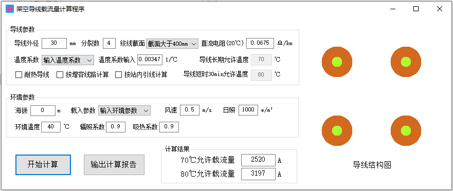
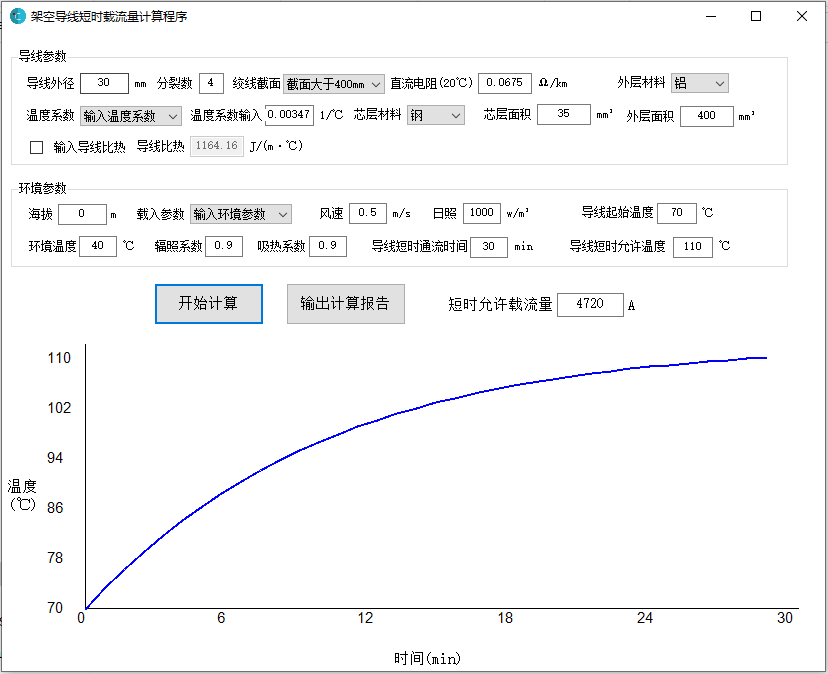
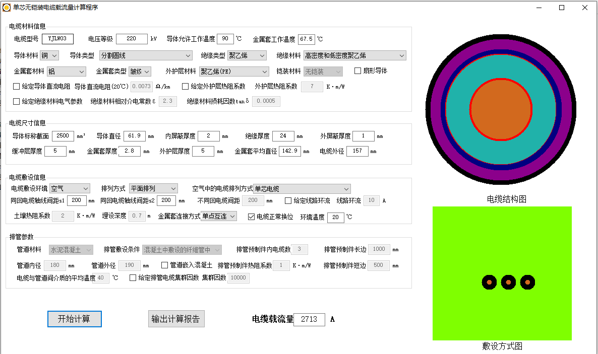

## Transmission Line Ampacity Rating Software
**Project description:** Ampacity rating is one of the important work in power grid design and operation. Correct ampacity rating can release the potential of the power transmission network while keep overheat risk at very low level. I developed the static and dynamic ampacity rating software for overhead transmission lines and static ampacity rating software for power cables. These software are with simple interface which is user friendly.

### Overhead transmission line ampacity rating
---
This interface can calculate the static ampacity of overhead transmission lines with the input parameters about the conductor and its long term withstand temperature.

---
This interface can calculate the dynamic ampacity of overhead transmission lines with the input parameters about the conductor and its short term withstand time period and temperature.

### Power cable ampacity rating
---
This interface can calculate the ampacity of single core high voltage cable with different cable and installation parameters.

