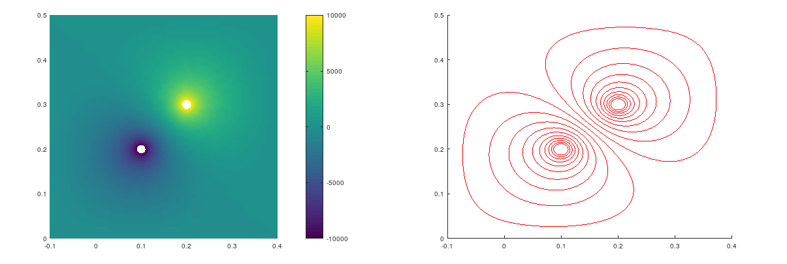

## Solving Electric Field by using Finite Element Method
**Project description:** I developed this Finite Element Method program to solve static electric field problems. The discretization of the computation space is not included in this program. The example show in this program is about solving the bipolar electric field problem. This program can be execute by Octave.

