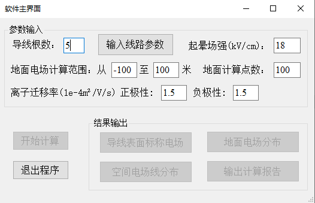
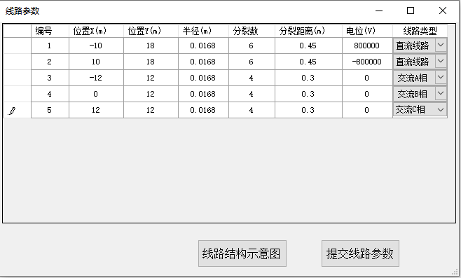
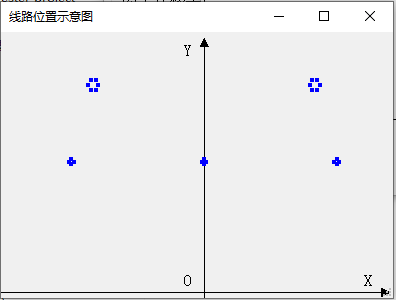
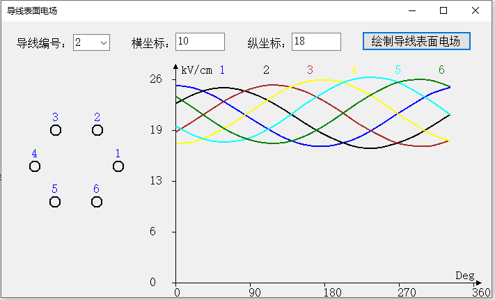
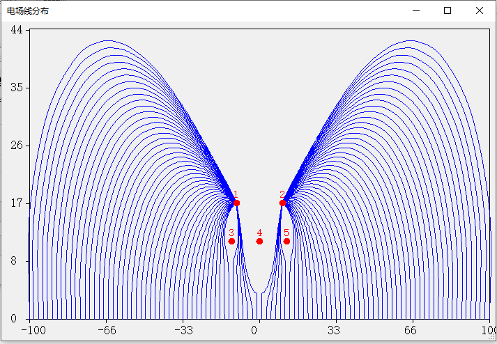
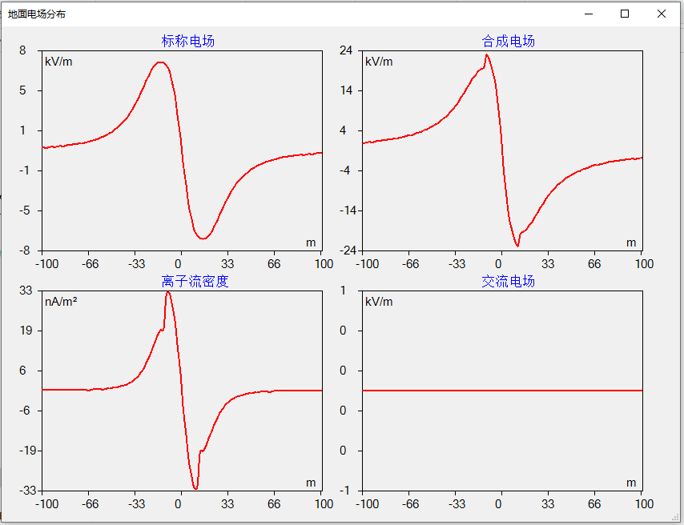

## Hybrid Corridor Ground Level Electric Field Calculation Software
**Project description:** Put HVAC and HVDC on the same tower or same corrior is called hybrid corridor, which is a effective way to enhance the power transmission capability of certain corridor. However, prediction of ground level electric field of hybrid corridor is quite challenging. I developed this application in the .NET framework and used C# language to simplify the hybrid corridor ground level electric field calculation.

### Parameters input interface
---
This interface take paramters input, including number of conductors, corona onset electric field  and ion mobilities et al.

---

This interface is specifically used to take the tower configuration parameters like horizontal and vertical position of conductors, split distance and type of conductors.

---

This interface is used for the user to check if the input parameters of the tower configuration is reasonable.

---

### Calculation results demonstration
---
This interface can show the surface electric field of the selected bundle conductors. The surface electric field is the most important value that can greatly influence the ground level electric field.

---

This interface shows the space electric field lines. These electric field lines determines how the ions emitted from the HVDC conductors drift to the ground.

---

This interface shows the calculated ground level ion-free field, ionized field, ion current density and AC electric field.

---
