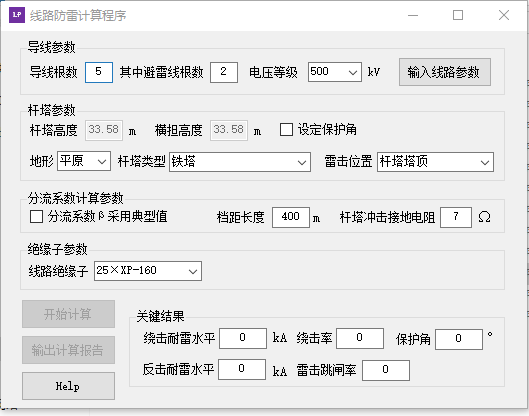

## Tower Ligtning Performance Calculation Software
**Project description:** After each time the transmission line tower stroke by lightning and caused lightning trip, the ligtrning performance of the tower need to be calculated to help the fault analysis and to determine what measure should be taken to reduce lightning trip rate. I developed this software to help the tower ligtning performance calculation. This software can perform both sheilding failure and back flashover calculation.

### Lightning withstand current calculation
---
This part of the software is used to calculate the shielding failure and back flashover lightning withstand current. The parameters like insulator height and tower footing impedance are in the main interface.

---
This interface is for the parameters of the configuration of the conductors.

### Electrical geometric model calculation

---
This interface is used to calculate the up limit of shielding failure current of the conductor on transmission line tower by using electrical geometric model.

---
This interface is used to calculate the effective protection area of horizontally installed lightning rod on the transmission line tower.

