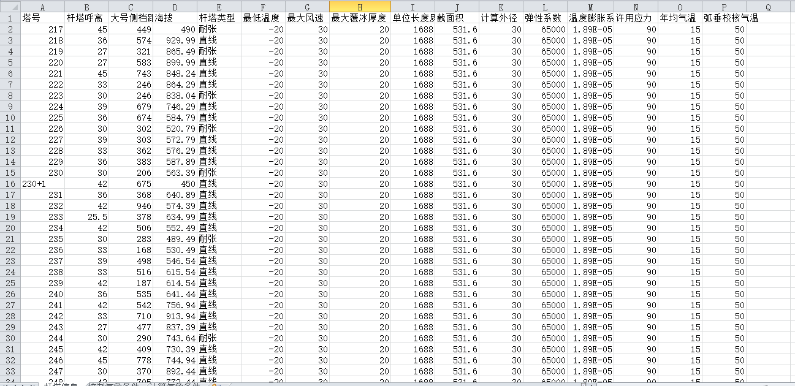
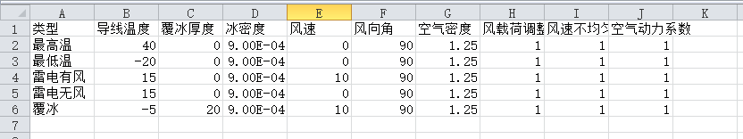
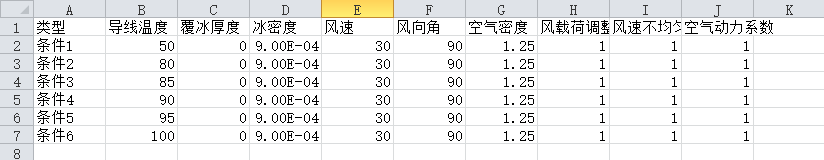
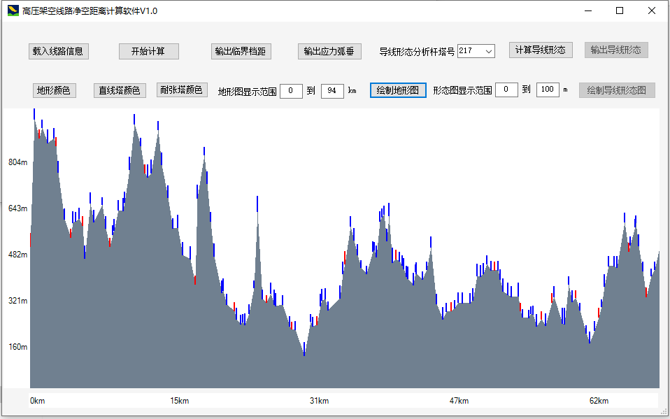
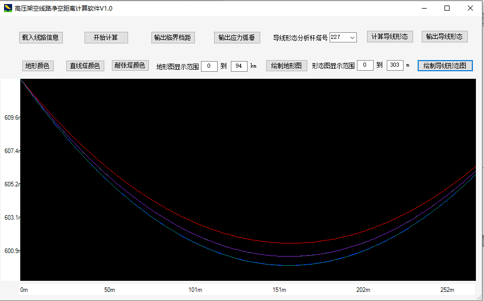

## Transmission Line Sag Calculation Software
**Project description:** Calulation of the line sag of HV transmission lines is a frequently encountered engineering problem, which is usually used to determine if the transmission line will have enough clearance to the ground. I developed this software to simplify the line sag calcualtion process.

### Parameters input interface
---
This software take input parameters from tables, this is the first table  which include parameters like tower number, tower height, and tower type et al.

---
This is the second table which include parameters of all the control environmental condition combinations.

---
This is the third table which include parameters of target environmental condition combinations.

### Calculation results demonstration

---
This interface can show the topography of the transmission line and the geological distribution of the towers.

---
This interface shows the calculated line sag of the selected span.

