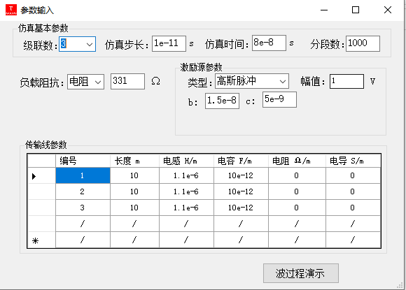
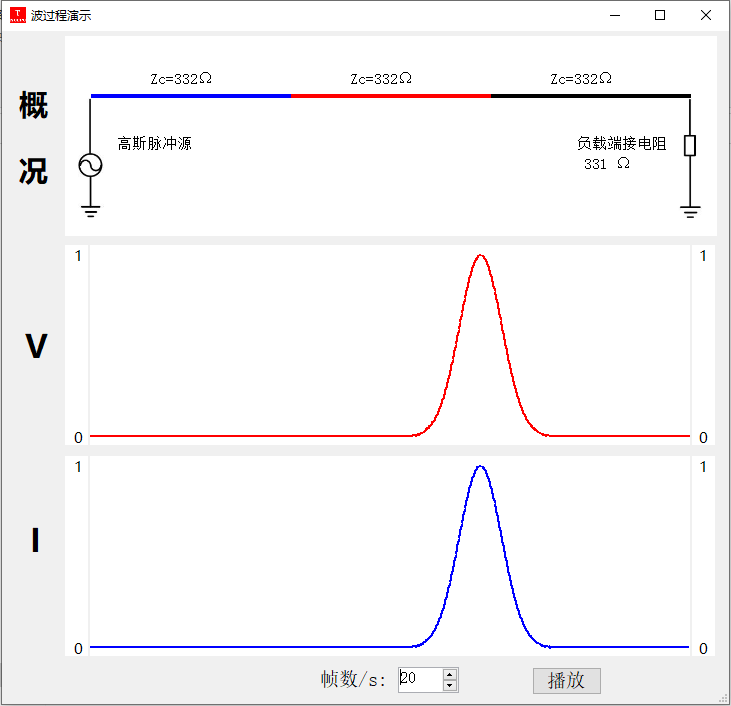

## Transmission Line Electromagnetic Wave Propagation Simulation
**Project description:** I developed this .NET application to help people understand how the electromagnetic wave are propagate along the transmission lines. The wave reflection and and refraction in different load and source conditions can be demonstrated in this application.

The parameter input interface of the application. This application support up to 5 cascaded connected segments of transmission lines. These segments can have different electrical parameters. The load can be open-end, short-circuit or end with resistance. The source can be Gaussian pulse waveform, double-exponential waveform or sinusoidal waveform.

The wave propagation demonstration interface of the application. The upper part is the schematic view of the transmission line system with the characteristic impedance are shown. The middle part is the voltage wave demonstration window and the lower part is the current waveform demonstration window.

